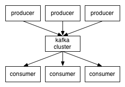
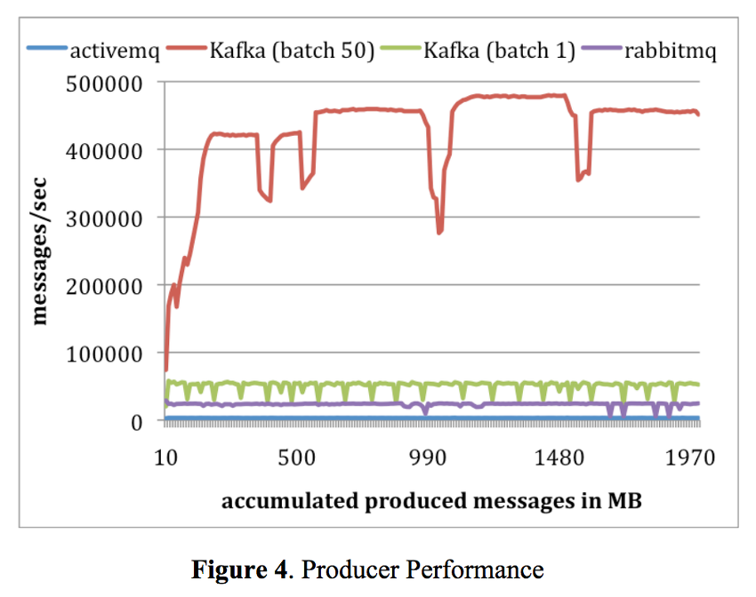
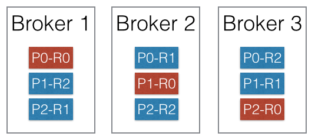
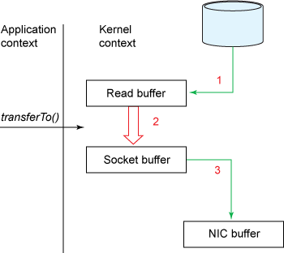
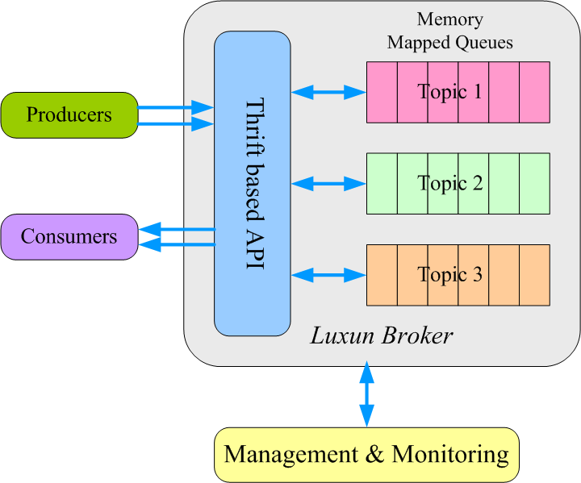

메세지 큐는 IPC(Inter-Process Communication) 도구 중 하나로 시스템 프로그래밍에서 사용됨. 이는 프로세스들 간에 이산적인 양의 데이터 송수신을 위해 사용하는데, 각 데이터를 메시지 형태로 생성, 전달하고 수신이 가능하게끔 Queue 데이터구조를 이용. 메세지 큐는 커널에서 전역적으로 관리되고, 모든 프로세스에서 접근 가능하도록 구성되어있으므로 하나의 메시지큐 서버가 커널에 요청헤서 메시지큐를 작성하게 되면 해당 식별자를 아는 모든 프로세서가 동일한 메시지큐에 접근하여 메세지를 공유. 리눅스, 윈도우 등 운영체제와 커널 종류에 따라서 고유한 메세지큐를 제공함.

메세지 큐의 또 다른 의미는 분산 메시징 시스템. 모니터링, 로그, 이벤트 메세지 등 아주 거대한 양의 데이터를 다룰 일이 생김에 따라 만들어짐. 큐는 여러 컴포넌트들이 데이터를 생성하고 또 저장하고 사용하는 과정에서 일종의 버퍼 역할을 수행함. 큐가 있음으로 producer과 consumer간의 속도가 다를 때, 둘 중 어느 한 컴포넌트가 네트워크에 연결되지 못한 상황 등에 대응이 가능. 기본적으로 분산 메시징 시스템은 어떤 특정 메시지가 최소한 한번은 전달될 수 있도록 보장하며 다수의 reader와 writer을 하나의 큐를 통해서 공유하고 상호작용할 수 있게끔 만듬.

### 장점

| 장점            | 설명                                                         |
| --------------- | ------------------------------------------------------------ |
| 확장성          | 기능 별로 모듈을 분리하여 구성하기 때문에 확장에 용이        |
| 데이터의 영속성 | 데이터를 메모리 대신에 디스크에 저장하여 데이터 유실을 방지  |
| 고가용성 유지   | 다소 지연시간을 희생하는 한이 있더라도 서비스 규모에 독립적으로 언제나 이용할 수 있는 상태를 유지 |
| 장애 복원력     | 단일 장애점 해소. 시스템 일부에 장애가 발생하더라도 전체적으로 영향을 주지 않음. 메세지가 큐에 추가되어있으므로 혹시라도 어떤 모듈에서 장애가 발생하였더라도 해당 모듈 복구 후 작업을 마저 수행하는 것이 가능. |

### 단점

큐를 운영하기 위한 추가적인 자원 필요, 큐에 들어가고 나오는 과정에서 피할 수 없는 오버헤드가 생겨남.

## 사용을 고려해볼 수 있는 상황

- 안정성, 고가용성을 위한 설계(즉각적인 업데이트는 보장하지 않음. 시스템에 확장성 필요. 데이터의 영속성 필요. 장애에 대한 복원력이 필요.)
  1. 특정한 시간에만 tps가 튀는 등의 사례. 추가적으로 장비를 투입하는 것보다 효율적인 방안이 필요한 경우
  2. 같은 IDC 안에서 메세지가 전송되는 등의 조건 하에 HTTP 프로토콜의 오버헤드가 큐를 사용할 때 증가하는 네트워크 레이턴시보다 커지는 경우
  3. 사용할 수 있는 자원에 비해서 처리해야될 데이터 양이 지나치게 많아 대응이 필요할 때
  4. 데이터가 생성되는 양에 비해서 소모되는 양이 눈에 띄게 차이나는 경우
  5. 다수의 어플리케이션이 어떤 데이터 저장소를 공유할 필요성이 있을 때

## Apache Kafka

http://kafka.apache.org/

### 특징

- pub-sub 구조에 특화된 분산 메세지 큐.
-  
- 범용 메세지 큐(RabbitMQ, ActiveMQ)에 비하여 성능적 우위를 가지고 있음.  
- broker들이 클러스터로 구성되어 동작하는 등 각 컴포넌트의 분산 및 복제 구성이 쉬움. 
- 단순한 TCP기반 프로토콜 사용으로 오버헤드 감소
- 다수의 메세지를 batch 형태로 한번에 publish 하는게 가능하여 TCP/IP 라운드 트립 횟수를 줄일 수 있음
- 메세지를 파일 시스템에 저장하여 영속성 보장. 특정 과정에서 에러가 발생했을 시 다시 rewind 하는 것이 가능.
- OS의 페이지 캐시를 활용, 메세지를 순차적으로 읽도록 하여 성능 면에서 가능한한 희생을 줄임.
- 커널모드와 유저모드간 불필요한 데이터 복제를 하지 않도록 하는 zero-copy를 이용하여 성능을 높임. 
- broker가 push하는 대신 consumer이 자체적으로 pull해서 consume하는 방식으로 consumer 성능을 최대한 활용 가능

## Luxun

https://github.com/bulldog2011/luxun 

### 특징

- Kafka와 전체적으로 유사한 구조.
- BigQueue라는 Memory mapped file 기반 시스템 사용. (성능상 우위를 내는 주요 요인)
- Communictaion layer로 Thrift RPC 사용

## Amazon SQS

http://aws.amazon.com/ko/documentation/sqs/

### 특징

- 메시지크기 256KB 제한 (그 이상은 Amazon S3에 저장됨)
- FIFO 엄격하게 지켜지지 않음. (순서를 엄격하게 지키기 위해선 추가적인 정렬 필요)
- 메세지를 여러 서버에 충분히 중복해서 저장하여 안정성 보장. 메세지가 전달된 다음에 직접 삭제를 하지 않으면 일정 시간 뒤 중복해서 받는 것이 가능함.
- 강력한 보안 및 ACL 지원

## RabbitMQ

http://www.rabbitmq.com/

### 특징

- AMQP(Advanced Message Queue Protocol) 0-9-1 버전 구현
- Mnesia 사용
- 얼랭 기반으로 높은 신뢰성과 분산 어플리케이션 구축 가능.
- Direct Exchange(Point to Point), Topic Exchange(Publish-Subscribe), Fanout Exchange(Multicast) 등의 라우팅 규칙 제공
- 뛰어난 범용성을 가지고 있음.
- 기본적으로 클러스터링 지원. 추가로 좀 더 높은 트래픽을 처리하기 위해 셔블, 페더레이션 플러그인 제공.

## ZeroMQ

http://zeromq.org/

### 특징

- 메세지큐라기보다는 소켓과 비슷한 개념으로 생각해볼 수 있음.
- 비동기 통신, queue를 다이나믹하게 생성.
- inproc, ipc, tcp, pgm, epgm등 다양한 전송 매체 사용 가능.
- 다양한 언어를 지원.
- 여러 패턴을 통해서 가용성, 신뢰성, 안정성, 확장성 등을 원하는 대로 구현 가능.
- in-memory message buffer만 제공하므로 영속성은 없음.