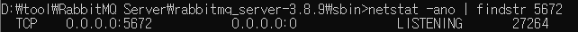

**AMQP란 무엇인가?**

\- Advanced Message Queing Protocol의 약자로, 흔히 알고 있는 MQ의 오픈소스에 기반한 표준 프로토콜을 의미한다. AMQP 자체는 프로토콜을 의미하기 때문에 이 프로토콜에 따른 실제 MQ 제품들은 여러가지가 존재할 수 있으나 최근 가장 많이 사용되는것은 아무래도 Erlang과 자바로 작성된 [RabbitMQ](http://www.rabbitmq.com/)라고 할 수 있다.

 

이 RabbitMQ를 설치해보고자 한다.

 

 

 https://www.rabbitmq.com/download.html

일단 RabbitMQ 를 다운로드 받아야 한다. 위의 사이트로 이동한다.

 


내 로컬 PC (Windows10) 에 설치를 하기 위해 Windows installer를 선택한다. 

 

 


다운로드를 다 받고 설치파일을 실행시키면 위와 같은 메세지가 나온다. RabbitMQ 를 사용하기 위해서는 **Erlang** 이라는게 먼저 설치가 되어 있어야 한다. 위에서 언급한 것처럼 Erlang을 통해 작성되었기 때문이다.

예(Y) 를 누르면 Erlang 다운로드 사이트로 이동을 하게 된다. 아니면 아래 링크를 눌러서 이동하면 된다.

 https://www.erlang.org/downloads


최신 Release가 된 **Windows 64-bit Binary File**을 받으면 된다. 

 


Erlang 설치화면이다 설치되는 디렉토리 경로정도 다른 곳으로 설정했고 나머지는 모두 기본값으로 설치했다.

 


Erlang이 설치가 다 되면 그제서야 RabbitMQ를 설치할 수 있다. 다시 RabbitMQ 설치파일을 누르자. 이것도 마찬가지로 설치되는 디렉토리 경로정도 다른 곳으로 설정했고 나머지는 모두 기본값으로 설치했다.

 

설치가 다 되었다면 RabbitMQ 를 시작해보자. 설치가 되면 자동으로 실행도 되지만 나중에 다시 시작하기 위해서 시작하는 방법도 알아보자. 

 


윈도우 시작버튼을 누르면 정상적으로 설치가 완료된 RabbitMQ Server 를 찾을 수 있다.

여기서 **RabbitMQ Service - start**를 눌러준다. 그럼 CMD가 하나 뜨면서 잘 시작 되었다는 메세지를 볼 수 있다. 


말은 잘 설치되었다지만 잘 설치되었는지 아직은 확인할 방법이 막막하기에 **RabbitMQ의 기본 port인 5672** 를 통해 프로세스가 떠있나 확인을 한번 해보자. 

 





잘 떠있는걸 확인할 수 있다. 반대로 stop 도 해보고 5672 포트가 있는지도 확인해보자. 

 


설치가 다 되었다면 CMD창을 열고 내가 설치경로로 지정한 곳의 sbin 폴더로 진입한다. 그리고 RabbitMQ management 실행을 위해 다음 명령어를 입력을 한다. 

```
> rabbitmq-plugins enable rabbitmq_management
```

조금 기다리면 위와 같은 로그들이 나오면서 management가 시작되었다고 나온다. 

 


RabbitMQ Management 접속은 **http://localhost:15672** 로 할 수 있다.

접속을 하면 위와 같은 로그인창이 나타나는데 **guest / guest** 로 접속할 수 있다. 

 


로그인이 되고 Management가 실행된 모습이다.

